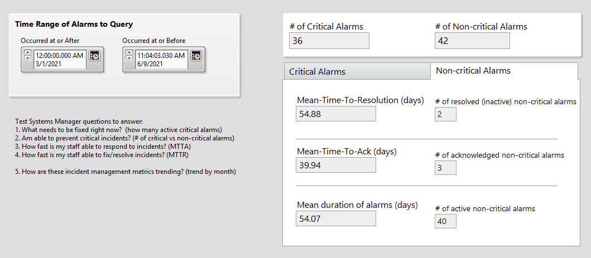

# systemlink-alarm-kpi
 LabVIEW example that calculates alarm/incident KPIs, such as MTTR and MTTA.

## Overview
This is currently just prototype-level code written in LabVIEW 2019.  If useful, I could potentially see functions like MTTR (mean-time-to-resolution), MTTA (mean-time-to-acknowledged), and mean duration of active alarms being added to (or supplement) the SystemLink Alarms LabVIEW API.

This code includes a library (.lvlib) with the following subVIs:
* Mean Time to Resolution.vi
* Mean Time to Acknowledged.vi
* Mean Duration of Active Alarms.vi

